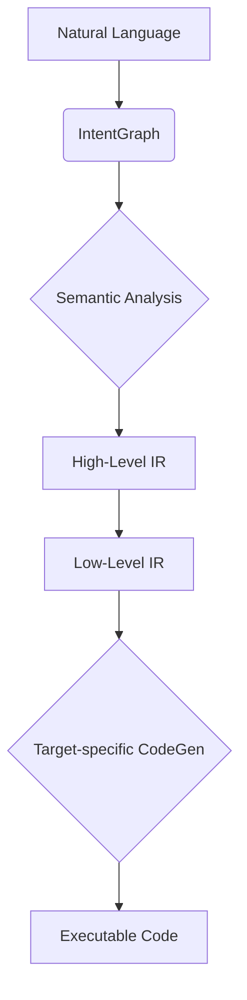
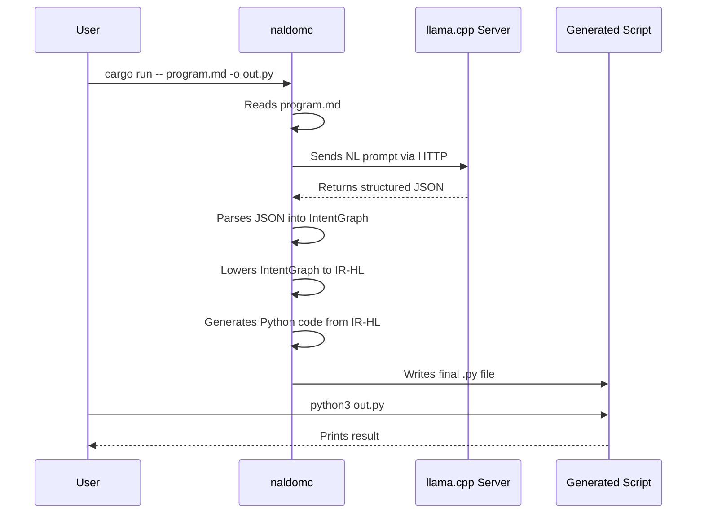

# Naldom Architecture Overview

This document provides a high-level overview of the Naldom compiler's architecture, both in its current prototype phase and its target state.

## Core Philosophy

The central idea behind Naldom is to treat compilation not as a rigid syntactic transformation, but as a multi-stage process of understanding and refinement. The pipeline is designed to progressively lower the level of abstraction, starting from pure human intent and ending with optimized machine code.

## Phase 1: Prototype Architecture

The working prototype establishes the core pipeline, using a Python backend for rapid development and validation.

### Compilation Pipeline (v0.1.0-alpha)

1.  **NLD Parser (LLM)**
    *   **Component:** `llama.cpp` server + `naldom-core/src/llm_inference.rs`.
    *   **Process:** The user's input from a `.md` file is sent via an HTTP request to a locally running `llama.cpp` server. A carefully engineered prompt instructs the LLM to analyze the request and return a structured JSON response. This client-server model was chosen for stability and to decouple the compiler from the complexities of direct library linking.

2.  **IntentGraph (Semantic Intent)**
    *   **Component:** `naldom-core/src/parser.rs` + `naldom-ir/src/lib.rs`.
    *   **Process:** The JSON string from the LLM is parsed into a `Vec<Intent>`. This is our **IntentGraph**—a high-level representation of *what* the user wants to achieve, completely detached from syntax. It represents pure semantic meaning.

3.  **IR-HL (High-Level IR)**
    *   **Component:** `naldom-core/src/lowering.rs` + `naldom-ir/src/lib.rs`.
    *   **Process:** The `IntentGraph` is "lowered" into a more traditional, language-agnostic intermediate representation (`HLProgram`). IR-HL describes the program as a sequence of statements like variable assignments and function calls. This stage introduces state management (e.g., tracking variables).

4.  **Code Generation (Python Backend)**
    *   **Component:** `naldom-core/src/codegen_python.rs`.
    *   **Process:** The `IR-HL` is traversed, and corresponding Python code is generated as a string.

5.  **Runtime & Packaging**
    *   **Component:** `runtime/python/naldom_runtime.py` + `naldom-cli/src/main.rs`.
    *   **Process:** A Python "standard library" (`naldom_runtime.py`) is embedded into the `naldomc` binary at compile time using `include_str!`. The final output script is an assembly of this runtime code and the newly generated logic.

### Data Flow Diagram

## Future Architecture (Phase 2 and Beyond)

The next major phase will replace the Python backend with a native compilation pipeline targeting LLVM.

-   **Semantic Analyzer:** A new stage will be introduced after the `IntentGraph` to perform type checking and logical validation before any code is generated.
-   **IR-LL (Low-Level IR):** A new, lower-level representation will be added to serve as a direct bridge to LLVM IR.
-   **LLVM Backend:** The Python code generator will be replaced with a new backend that uses `inkwell` to generate LLVM IR.
-   **Native Runtime:** The Python runtime will be replaced with a minimal, high-performance runtime written in Rust and/or C.
-   **Multi-Target Support:** The LLVM backend will enable us to target multiple platforms, including native binaries (Linux, macOS, Windows) and WebAssembly.