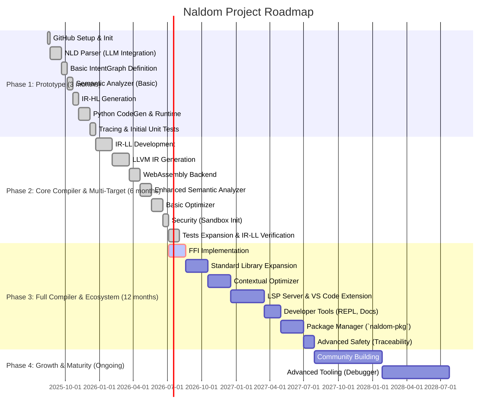

# Naldom Project Roadmap

This document outlines the planned development phases and key milestones for the Naldom language.

```mermaid
gantt
    dateFormat  YYYY-MM-DD
    title Naldom Project Roadmap

    section Phase 1: Prototype (3 months)
    GitHub Setup & Init                  :done, 2025-08-15, 7d
    NLD Parser (LLM Integration)         :done, 2025-08-22, 30d
    Basic IntentGraph Definition         :done, 2025-09-22, 15d
    Semantic Analyzer (Basic)            :done, 2025-10-07, 15d
    IR-HL Generation                     :done, 2025-10-22, 15d
    Python CodeGen & Runtime             :done, 2025-11-06, 30d
    Tracing & Initial Unit Tests         :done, 2025-12-06, 15d

    section Phase 2: Core Compiler & Multi-Target (6 months)
    IR-LL Development                    :done, 2025-12-21, 45d
    LLVM IR Generation                   :done, 2026-02-04, 45d
    WebAssembly Backend                  :done, 2026-03-21, 30d
    Enhanced Semantic Analyzer           :done, 2026-04-20, 30d
    Basic Optimizer                      :done, 2026-05-20, 30d
    Security (Sandbox Init)              :done, 2026-06-19, 15d
    Tests Expansion & IR-LL Verification :done, 2026-07-04, 30d

    section Phase 3: Full Compiler & Ecosystem (12 months)
    FFI Implementation                   :crit, active, 2026-07-05, 45d
    Standard Library Expansion           :2026-08-19, 60d
    Contextual Optimizer                 :2026-10-18, 60d
    LSP Server & VS Code Extension       :2026-12-17, 90d
    Developer Tools (REPL, Docs)         :2027-03-17, 45d
    Package Manager (`naldom-pkg`)       :2027-05-01, 60d
    Advanced Safety (Traceability)       :2027-06-30, 30d

    section Phase 4: Growth & Maturity (Ongoing)
    Community Building                   :2027-07-30, 180d
    Advanced Tooling (Debugger)          :2028-01-26, 180d
```